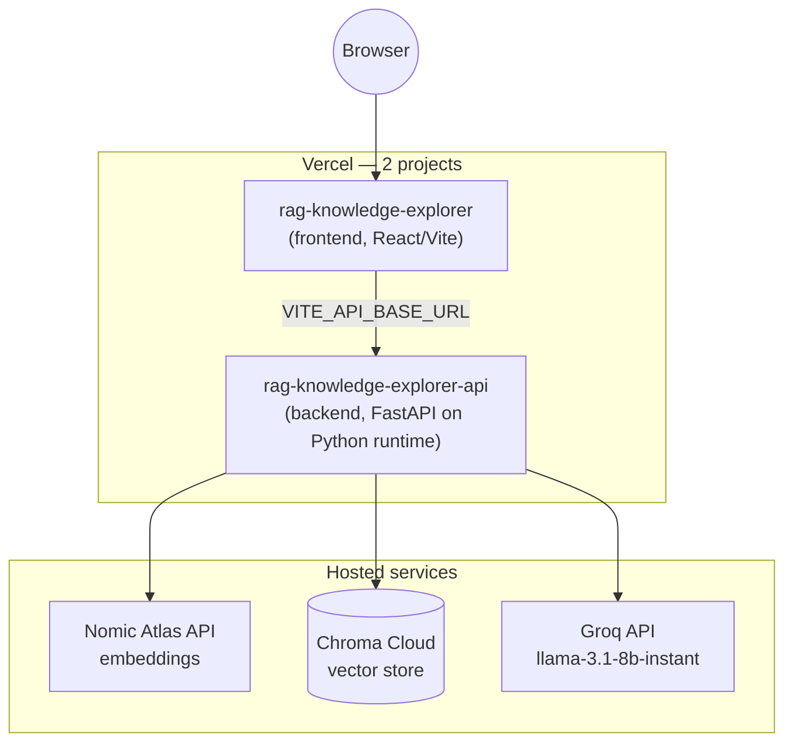

# Deploying RAG Explorer to Vercel

Vercel Functions are **stateless and ephemeral** — they can't run a persistent Ollama server, and they can't keep a local ChromaDB folder on disk between requests. To deploy fully on Vercel, this project's backend was changed to use two hosted (still free-tier-friendly) services instead of local ones:

| Local/desktop version | Vercel version |
|---|---|
| Ollama running `nomic-embed-text` on your machine | **Nomic Atlas** hosted embedding API (`nomic-embed-text-v1.5`) |
| ChromaDB `PersistentClient` writing to `backend/chroma_db/` | **Chroma Cloud** hosted vector database |
| Background thread + polled `/api/ingest/progress` | Stateless `/api/ingest/start` + `/api/ingest/step`, looped from the browser |

This is a one-way switch in this codebase — the local-Ollama/local-ChromaDB code path was replaced, not kept side-by-side, to avoid maintaining two implementations. (It's still recoverable from git history if you ever want to run purely offline again.) One practical consequence: **local development now also needs the two cloud accounts below** — there's no more local-only mode.



---

## 1. Create accounts and get API keys

| Service | Where | What you need |
|---|---|---|
| **Nomic Atlas** | [atlas.nomic.ai](https://atlas.nomic.ai) → API keys | `NOMIC_API_KEY` (1M free tokens included) |
| **Chroma Cloud** | [trychroma.com/cloud](https://www.trychroma.com/cloud) | `CHROMA_API_KEY`, `CHROMA_TENANT`, `CHROMA_DATABASE` (create a database in the dashboard) |
| **Groq** | [console.groq.com](https://console.groq.com) | `GROQ_API_KEY` (you likely already have this) |
| **Vercel** | [vercel.com](https://vercel.com) | An account + the [Vercel CLI](https://vercel.com/docs/cli): `npm i -g vercel` |

---

## 2. Deploy the backend

The backend is deployed as its **own Vercel project**, rooted at `backend/`, so it's a self-contained bundle (it includes its own copy of the sample PDFs at `backend/data/data/`).

```bash
cd backend
vercel login          # one-time
vercel                # first deploy — follow the prompts, set root directory to "." (you're already in backend/)
```

When prompted, link it to a new project (e.g. `rag-knowledge-explorer-api`). After the first deploy, set the environment variables in the Vercel dashboard (**Project → Settings → Environment Variables**) or via CLI:

```bash
vercel env add GROQ_API_KEY
vercel env add GROQ_MODEL          # llama-3.1-8b-instant
vercel env add NOMIC_API_KEY
vercel env add EMBED_MODEL         # nomic-embed-text-v1.5
vercel env add CHROMA_API_KEY
vercel env add CHROMA_TENANT
vercel env add CHROMA_DATABASE
```

Then redeploy so the new env vars take effect:

```bash
vercel --prod
```

Note the deployment URL Vercel gives you, e.g. `https://rag-knowledge-explorer-api.vercel.app`. Verify it's alive:

```bash
curl https://rag-knowledge-explorer-api.vercel.app/api/health
# {"status":"ok"}
```

---

## 3. Deploy the frontend

```bash
cd frontend
vercel login          # if not already done
vercel
```

Link it to a new project (e.g. `rag-knowledge-explorer`). Vercel auto-detects Vite and needs no build config. Set the one environment variable it needs — the backend URL from step 2:

```bash
vercel env add VITE_API_BASE_URL
# paste: https://rag-knowledge-explorer-api.vercel.app   (no trailing slash)
```

Redeploy to bake that env var into the build (Vite env vars are compiled in at build time, not read at runtime):

```bash
vercel --prod
```

---

## 4. Lock down CORS (recommended)

`backend/app/main.py` currently allows `allow_origins=["*"]` since the frontend's final `.vercel.app` URL isn't known until step 3 finishes. Once you have it, tighten this:

```python
app.add_middleware(
    CORSMiddleware,
    allow_origins=["https://rag-knowledge-explorer.vercel.app"],
    allow_methods=["*"],
    allow_headers=["*"],
)
```

Commit and redeploy the backend (`vercel --prod` from `backend/`).

---

## 5. Try it

Open your frontend's Vercel URL, click **Run Ingestion**, and watch the progress bar — each batch of ~20 chunks is one call to `/api/ingest/step`, driven by the browser in a loop (see [Flow_Control.md](Flow_Control.md) for the full sequence diagram). Once at least some documents show `done`, ask a question.

---

## Troubleshooting

| Symptom | Likely cause |
|---|---|
| `/api/status` or `/api/query` returns `502 Could not connect to Chroma Cloud` | Wrong/missing `CHROMA_API_KEY`, `CHROMA_TENANT`, or `CHROMA_DATABASE` — double-check the database exists in the Chroma Cloud dashboard |
| Ingestion fails with a Nomic error | Check `NOMIC_API_KEY` is set and the account has remaining token quota |
| Frontend shows "Failed to fetch" | `VITE_API_BASE_URL` wasn't set before the build, or CORS on the backend doesn't allow the frontend's origin |
| Ingestion step calls time out | Increase `maxDuration` in `backend/vercel.json` (Hobby plans support up to ~300s with Fluid compute; Pro up to 800s, 30 min in beta) — or lower the batch size via the `batch_size` field sent to `/api/ingest/step` |
| Deploy fails on bundle size | The `chromadb` + `nomic` packages pull in some heavier transitive dependencies (pandas, pyarrow, pillow); this should still be well under Vercel's 500MB function limit, but if it ever isn't, that's the place to look |
