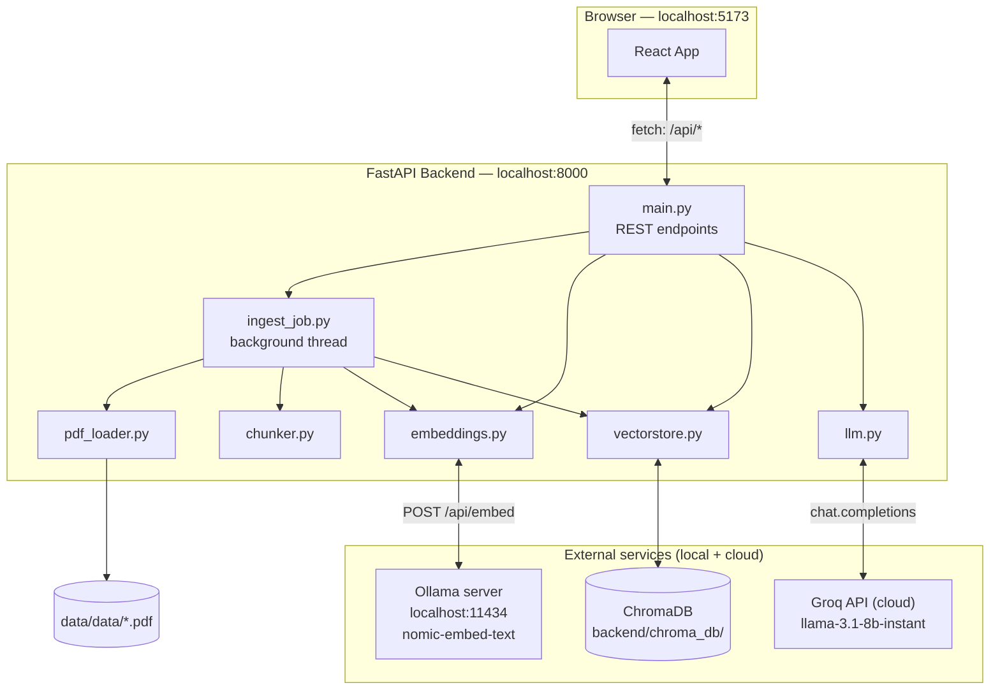
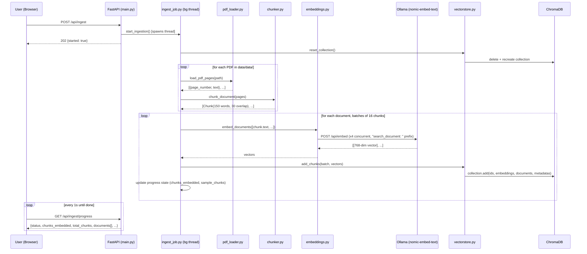
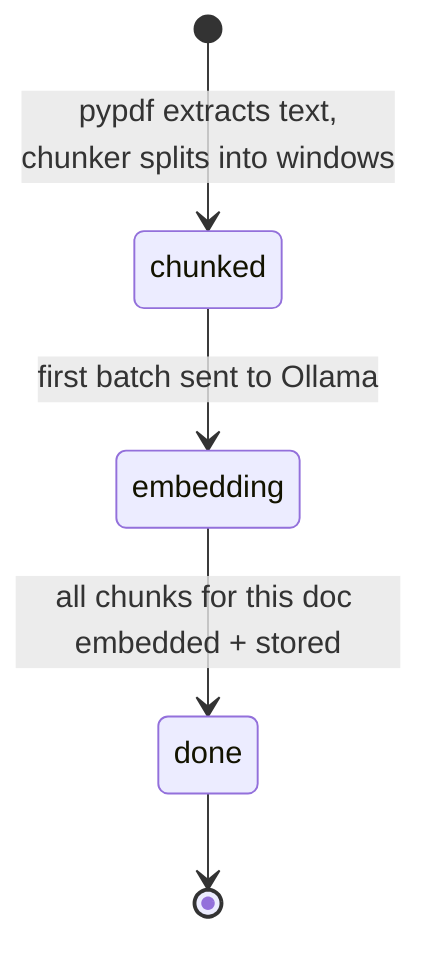
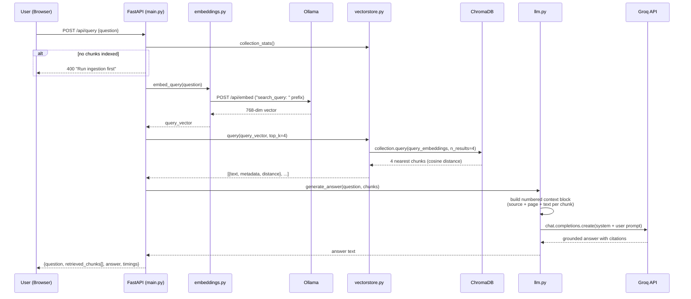
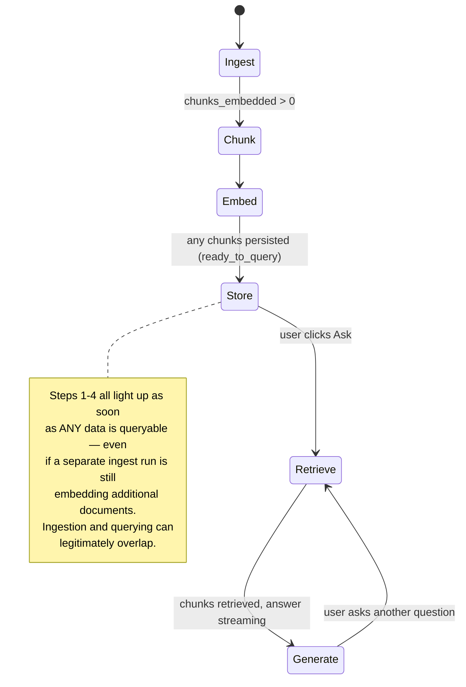
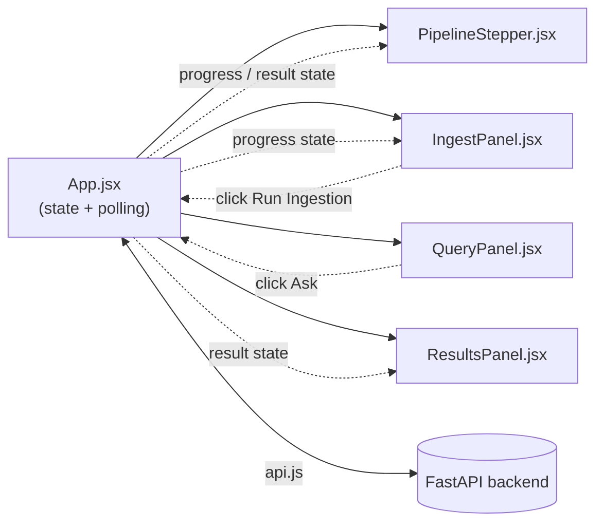

# Flow_Control.md — RAG Explorer

A complete, diagram-first walkthrough of this project: what it is, how it's structured, and exactly how data moves through it — from a PDF on disk to a cited, LLM-generated answer.

---

## 1. What this is

**RAG Explorer** is a React + FastAPI application that demonstrates a full Retrieval-Augmented Generation (RAG) pipeline over a folder of PDFs, with every stage — ingestion, chunking, embedding, storage, retrieval, and answer generation — visible in the UI as it happens. It's a teaching/demo tool, not a production RAG system: intermediate pipeline state (chunk previews, embedding dimensions, per-document progress, similarity scores) is deliberately surfaced rather than hidden behind a single "ask a question" box.

| Layer | Technology |
|---|---|
| Frontend | React 19 + Vite 5 |
| Backend API | FastAPI (Python) |
| PDF parsing | pypdf |
| Embedding model | `nomic-embed-text`, served locally via Ollama |
| Vector store | ChromaDB (local, persistent, on disk) |
| LLM (answer generation) | Groq API — `llama-3.1-8b-instant` |

---

## 2. System architecture



---

## 3. Ingestion flow — PDF → searchable vectors

Triggered when the user clicks **Run Ingestion** (`POST /api/ingest`). This starts a background thread and returns immediately; the frontend polls `GET /api/ingest/progress` every second until it finishes.



**Chunk ID format:** `{filename}::p{page_number}::c{running_index}` — e.g. `BRD-EC-CKP-004-Checkout-Payment.pdf::p2::c14`.

### Per-document ingestion status lifecycle



---

## 4. Query flow — question → grounded answer

Triggered when the user clicks **Ask** (`POST /api/query {question}`). This one is fast and synchronous (no polling needed).



The system prompt sent to Groq enforces three rules: answer **only** from the given context, **cite** `(source: FILE, p.N)` for claims, and **say so explicitly** if the context doesn't contain the answer — this is what keeps the demo grounded instead of hallucinating.

---

## 5. Frontend: pipeline stepper state machine

`App.jsx` derives a single active stage (out of 6) plus a set of "completed" stages from `status`, `progress`, `asking`, and `result` — shown visually by `PipelineStepper.jsx`.



### Component / data flow on the frontend



---

## 6. Project structure

```
RAG_Explorer_E_Commerce/
├── data/data/                  Source PDFs the pipeline ingests (10 sample BRDs)
├── backend/
│   ├── app/
│   │   ├── config.py           Central config, reads backend/.env
│   │   ├── pdf_loader.py       PDF → per-page plain text
│   │   ├── chunker.py          Per-page text → overlapping word-window chunks
│   │   ├── embeddings.py       Calls Ollama for Nomic embeddings (concurrent)
│   │   ├── vectorstore.py      ChromaDB persistent client wrapper
│   │   ├── ingest_job.py       Background-thread ingestion job + progress state
│   │   ├── llm.py              Groq chat completion, context-grounded prompt
│   │   └── main.py             FastAPI routes
│   ├── chroma_db/              ChromaDB's on-disk persistence (auto-created, gitignored)
│   ├── requirements.txt
│   ├── .env                    Actual secrets/config — gitignored, never committed
│   └── .env.example            Template for .env
├── frontend/
│   ├── src/
│   │   ├── api.js               fetch wrappers for the backend
│   │   ├── App.jsx               Top-level state machine + pipeline stepper logic
│   │   ├── App.css / index.css   Styling
│   │   └── components/
│   │       ├── PipelineStepper.jsx   6-stage visual stepper
│   │       ├── IngestPanel.jsx       Ingestion trigger + live progress
│   │       ├── QueryPanel.jsx        Question input + sample questions
│   │       └── ResultsPanel.jsx      Retrieved chunks + generated answer
│   └── package.json
├── README.md                   Setup/run instructions
├── CLAUDE.md                   Guidance for AI coding agents working in this repo
└── Flow_Control.md             This file
```

> **Note on `data/data`:** Windows filesystems are case-insensitive, so a top-level `Data/` and `data/` are the *same* physical directory here — the real path is `.../Data/data/*.pdf`. `config.py`'s `DATA_DIR` default resolves to exactly this nested path, matching the original project spec.

---

## 7. API reference

| Method | Path | Purpose |
|---|---|---|
| GET | `/api/health` | Liveness check |
| GET | `/api/config` | Current embed/LLM models, chunk size/overlap, top_k, data dir |
| GET | `/api/status` | PDFs found on disk, what's indexed (chunk/doc count, source list), `ready_to_query` |
| POST | `/api/ingest` | Starts the background ingestion job (409 if one is already running) |
| GET | `/api/ingest/progress` | Poll target for live ingestion state |
| POST | `/api/query` | `{question, top_k?}` → retrieved chunks + generated answer |

CORS is restricted to `http://localhost:5173` (the Vite dev server origin).

---

## 8. Key design decisions (and why)

- **Ingestion is a background job, not a blocking request.** Embedding on CPU-only Ollama can take several seconds per chunk; a 300+ chunk corpus can take 15-20+ minutes. A blocking HTTP call would exceed any reasonable timeout and give no feedback. `ingest_job.py` runs on a `threading.Thread`, mutates a lock-guarded in-memory state dict, and `GET /api/ingest/progress` just reads it.
- **Embedding calls are concurrent (4 workers)** via `ThreadPoolExecutor`, tuned empirically for this hardware — CPU-bound Ollama inference is the throughput bottleneck, not the network.
- **Chunking is per-page**, never spanning a page boundary, so `page_number` in chunk metadata is always exactly correct — used for citations in the generated answer.
- **Nomic's prefix convention is honored**: `"search_document: "` on indexed text, `"search_query: "` on queries, for asymmetric retrieval quality.
- **The LLM is told to ground strictly in retrieved context** and cite `(source, page)`, and to admit when context is insufficient.
- **ChromaDB stores pre-computed embeddings directly** (`collection.add(embeddings=...)`) since embedding happens via an external Ollama call, not Chroma's built-in embedding function.
- **`.env` overrides the shell environment** (`load_dotenv(..., override=True)`) so the project's own config always wins over any stale environment variable.

---

## 9. Configuration reference (`backend/.env`)

| Variable | Default | Meaning |
|---|---|---|
| `GROQ_API_KEY` | *(required)* | Groq API key for answer generation |
| `GROQ_MODEL` | `openai/gpt-oss-120b` | Set to `llama-3.1-8b-instant` in this project |
| `OLLAMA_BASE_URL` | `http://localhost:11434` | Local Ollama server address |
| `EMBED_MODEL` | `nomic-embed-text` | Must already be pulled: `ollama pull nomic-embed-text` |
| `CHUNK_SIZE_WORDS` | `150` | Words per chunk |
| `CHUNK_OVERLAP_WORDS` | `30` | Word overlap between consecutive chunks on the same page |
| `TOP_K` | `4` | Chunks retrieved per query |
| `DATA_DIR` | `<project_root>/data/data` | Where source PDFs are read from |
| `CHROMA_DIR` | `backend/chroma_db` | Where the vector index persists |

`backend/.env` is gitignored — never committed. Copy `backend/.env.example` and fill in your own key to run this project.

---

## 10. Running it

```bash
# Terminal 1 — embedding model server
ollama serve                                   # if not already running as a service
ollama pull nomic-embed-text                   # one-time

# Terminal 2 — backend
cd backend
pip install -r requirements.txt
python -m uvicorn app.main:app --port 8000

# Terminal 3 — frontend
cd frontend
npm install
npm run dev
```

Open **http://localhost:5173**, click **Run Ingestion**, then ask a question once at least some documents show `done`.

---

## 11. Environment quirks hit during setup (all resolved)

1. **`chromadb`'s compiled `hnswlib` dependency** had no installable wheel for this Python/Windows combo (no C++ build tools present). Fix: pin `chroma-hnswlib==0.7.5`, which ships a prebuilt `win_amd64` wheel.
2. **Vite 8 (Rolldown bundler)** has a native-binding resolution bug on some Node/npm combinations. Fix: pinned to stable Vite 5 (`@vitejs/plugin-react@^4`), esbuild-based.
3. **A standalone system Chrome browser** can attach `--headless --print-to-pdf` invocations to an already-running session instead of launching isolated, silently producing broken output. Not relevant at runtime, but relevant if regenerating the sample PDFs — use Playwright's bundled Chromium instead.

---

## 12. Sample data

`data/data/` ships with 10 fictional Business Requirement Documents for "ShopSphere Technologies Pvt. Ltd.", an invented e-commerce platform — one BRD per module (User Registration & Login, Product Catalog, Shopping Cart, Checkout & Payment, Order Management, Inventory, Returns & Refunds, Customer Reviews, Admin Dashboard, Notification Service). Each follows a consistent 23-section structure (Executive Summary, Business/Functional/Non-Functional Requirements, User Stories, Acceptance Criteria, Business Rules, Risks, Glossary, etc.) with realistic requirement IDs (`BR-`, `FR-`, `NFR-`, `US-`, `AC-`, `RULE-`), and the documents deliberately share terminology, stakeholder names, and integrated systems across files to simulate a real enterprise knowledge base — good for exercising cross-document retrieval.

Swap in your own PDF(s) by dropping them into `data/data/` and re-running ingestion (this fully re-indexes everything currently in that folder from scratch).
