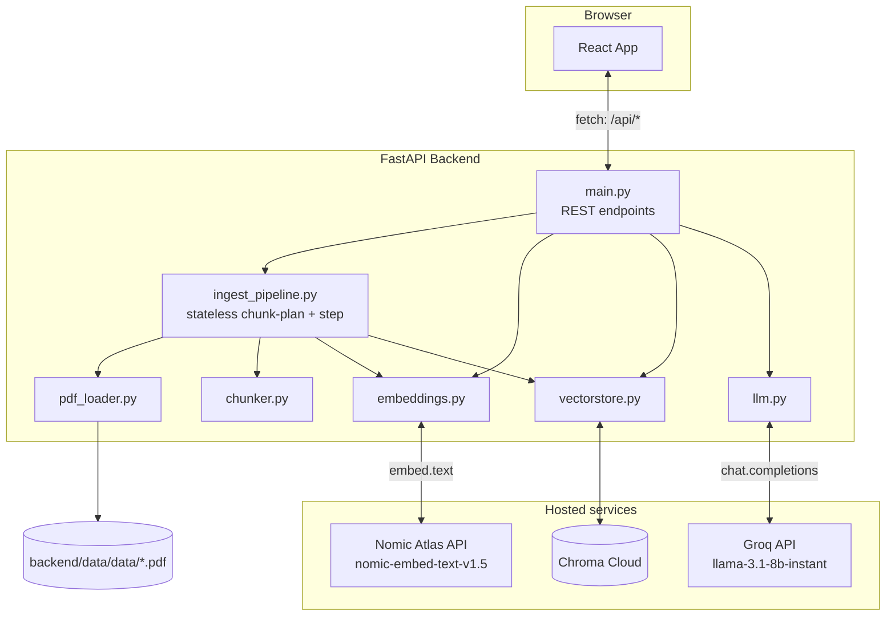
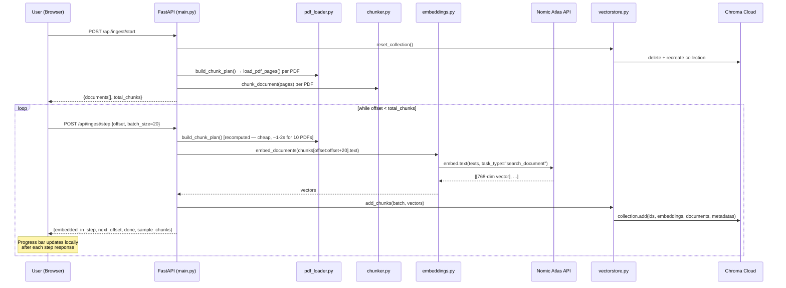
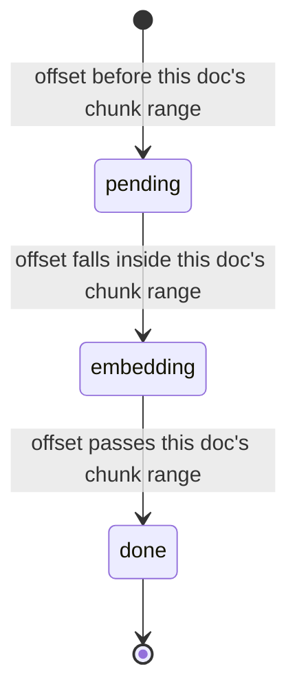
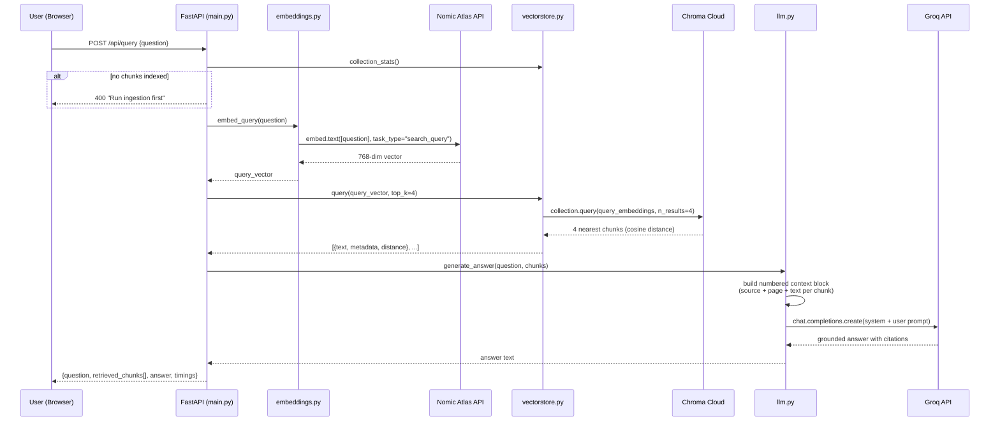
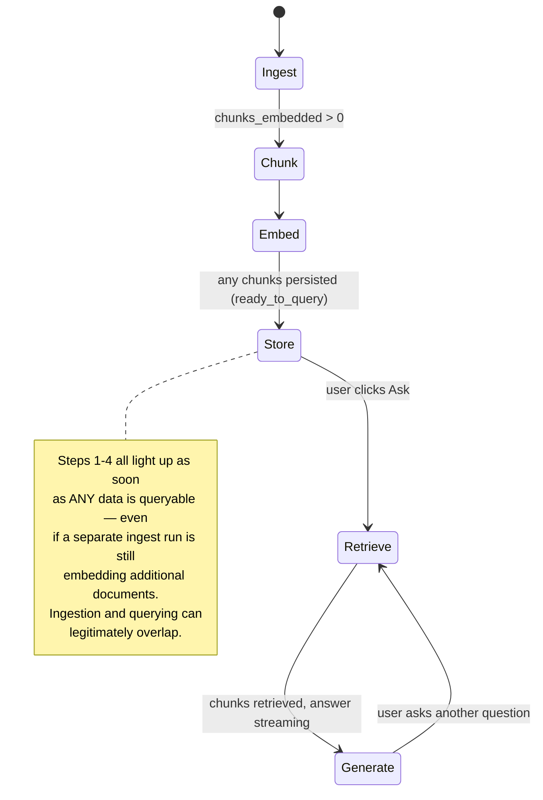
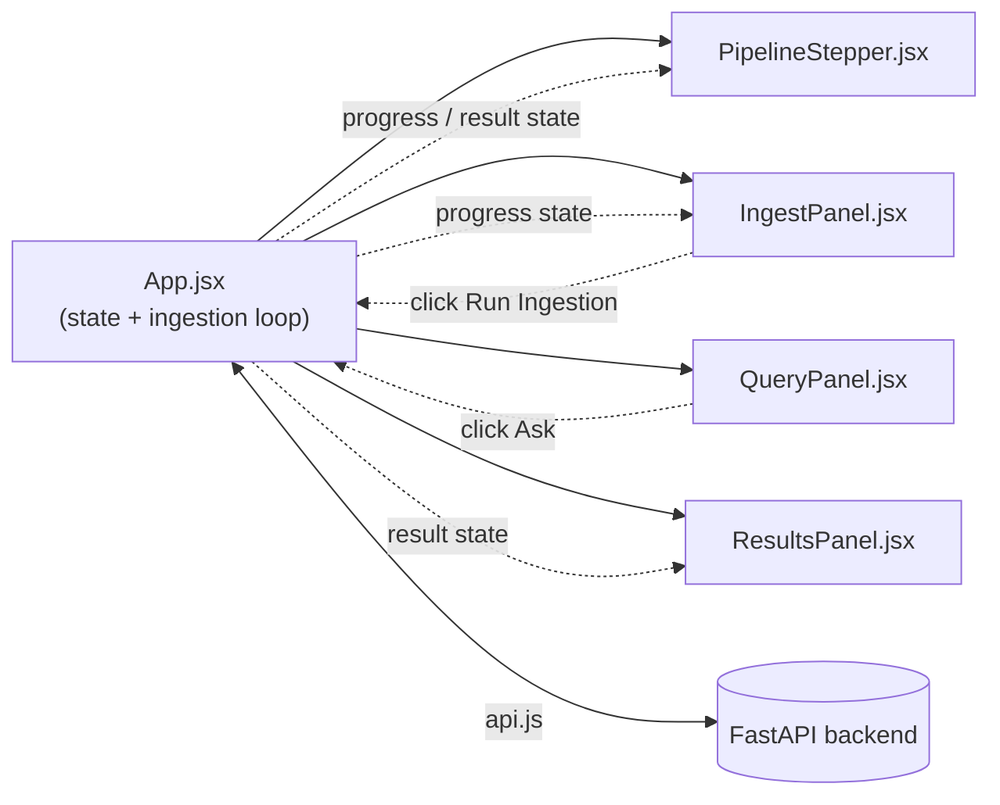

# Flow_Control.md — RAG Explorer

A complete, diagram-first walkthrough of this project: what it is, how it's structured, and exactly how data moves through it — from a PDF on disk to a cited, LLM-generated answer.

> ☁️ This describes the cloud-services architecture (Nomic Atlas + Chroma Cloud), which is what lets this app deploy on Vercel. See [DEPLOYMENT.md](DEPLOYMENT.md) for deployment steps.

---

## 1. What this is

**RAG Explorer** is a React + FastAPI application that demonstrates a full Retrieval-Augmented Generation (RAG) pipeline over a folder of PDFs, with every stage — ingestion, chunking, embedding, storage, retrieval, and answer generation — visible in the UI as it happens. It's a teaching/demo tool, not a production RAG system: intermediate pipeline state (chunk previews, embedding dimensions, per-document progress, similarity scores) is deliberately surfaced rather than hidden behind a single "ask a question" box.

| Layer | Technology |
|---|---|
| Frontend | React 19 + Vite 5 |
| Backend API | FastAPI (Python), deployable as Vercel Functions |
| PDF parsing | pypdf |
| Embedding model | `nomic-embed-text-v1.5` via the hosted Nomic Atlas API |
| Vector store | Chroma Cloud (hosted) |
| LLM (answer generation) | Groq API — `llama-3.1-8b-instant` |

---

## 2. System architecture



**Why hosted services instead of local Ollama + local ChromaDB?** Vercel Functions are stateless and ephemeral — they can't run a persistent local model server, and nothing written to local disk survives between invocations. Nomic Atlas and Chroma Cloud replace those local pieces so the exact same backend code runs identically whether it's a long-lived local process or a short-lived serverless function. See §8 for the ingestion design change this required.

---

## 3. Ingestion flow — PDF → searchable vectors

Ingestion is **stateless and client-driven** — there's no server-side background job. The browser calls `POST /api/ingest/start` once, then loops calling `POST /api/ingest/step` with an advancing offset until every chunk is embedded. This works identically whether the backend is a persistent process or a fleet of independent serverless invocations, since no state needs to survive between calls — each `step` call recomputes the same deterministic chunk plan and only touches its own slice of it.



**Chunk ID format:** `{filename}::p{page_number}::c{running_index}` — e.g. `BRD-EC-CKP-004-Checkout-Payment.pdf::p2::c14`.

### Per-document ingestion status (derived client-side)

The backend only reports raw offsets; `App.jsx` derives each document's display status from where the current offset falls within that document's cumulative chunk range.



---

## 4. Query flow — question → grounded answer

Triggered when the user clicks **Ask** (`POST /api/query {question}`). This one is fast and synchronous (no loop needed) — retrieval is a single Chroma Cloud call and generation is a single Groq call.



The system prompt sent to Groq enforces three rules: answer **only** from the given context, **cite** `(source: FILE, p.N)` for claims, and **say so explicitly** if the context doesn't contain the answer — this is what keeps the demo grounded instead of hallucinating.

---

## 5. Frontend: pipeline stepper state machine

`App.jsx` derives a single active stage (out of 6) plus a set of "completed" stages from `status`, `progress`, `asking`, and `result` — shown visually by `PipelineStepper.jsx`. Unlike the old polling design, `progress` here is updated directly inside the client-side ingestion loop (§3), not fetched from a separate status endpoint.



### Component / data flow on the frontend



---

## 6. Project structure

```
RAG_Explorer_E_Commerce/
├── backend/                     Self-contained FastAPI app (its own Vercel project)
│   ├── app/
│   │   ├── config.py            Central config, reads backend/.env
│   │   ├── pdf_loader.py        PDF → per-page plain text
│   │   ├── chunker.py           Per-page text → overlapping word-window chunks
│   │   ├── embeddings.py        Calls Nomic Atlas API for embeddings
│   │   ├── vectorstore.py       Chroma Cloud client wrapper (lazy-constructed)
│   │   ├── ingest_pipeline.py   Stateless chunk-plan + step-based ingestion
│   │   ├── llm.py               Groq chat completion, context-grounded prompt
│   │   └── main.py              FastAPI routes
│   ├── data/data/                Source PDFs the pipeline ingests (10 sample BRDs)
│   ├── main.py                  Vercel Python entrypoint (re-exports app.main:app)
│   ├── vercel.json              maxDuration config for the ingest step function
│   ├── requirements.txt
│   ├── .env                     Actual secrets/config — gitignored, never committed
│   └── .env.example             Template for .env
├── frontend/
│   ├── src/
│   │   ├── api.js                fetch wrappers for the backend
│   │   ├── App.jsx                Top-level state machine + ingestion loop + stepper logic
│   │   ├── App.css / index.css    Styling
│   │   └── components/
│   │       ├── PipelineStepper.jsx   6-stage visual stepper
│   │       ├── IngestPanel.jsx       Ingestion trigger + live progress
│   │       ├── QueryPanel.jsx        Question input + sample questions
│   │       └── ResultsPanel.jsx      Retrieved chunks + generated answer
│   ├── .env.example              Template for VITE_API_BASE_URL
│   └── package.json
├── README.md                    Setup/run instructions
├── DEPLOYMENT.md                 Step-by-step Vercel deployment guide
├── CLAUDE.md                    Guidance for AI coding agents working in this repo
└── Flow_Control.md              This file
```

---

## 7. API reference

| Method | Path | Purpose |
|---|---|---|
| GET | `/api/health` | Liveness check |
| GET | `/api/config` | Current embed/LLM models, chunk size/overlap, top_k, batch size, data dir |
| GET | `/api/status` | PDFs found on disk, what's indexed (chunk/doc count, source list), `ready_to_query` |
| POST | `/api/ingest/start` | Resets the collection, returns the chunk plan `{documents[], total_chunks}` — no embedding yet |
| POST | `/api/ingest/step` | `{offset, batch_size?}` → embeds+stores that slice, returns `{embedded_in_step, next_offset, done, sample_chunks}` |
| POST | `/api/query` | `{question, top_k?}` → retrieved chunks + generated answer |

CORS defaults to `allow_origins=["*"]` (see `main.py`) since the frontend's deployed URL isn't known until after the first Vercel deploy — tighten this to the actual frontend origin once deployed (see [DEPLOYMENT.md](DEPLOYMENT.md) §4).

`VectorStoreError` (raised by `vectorstore.py` on any Chroma Cloud connection/request failure) is caught by a global FastAPI exception handler and converted to a clean `502` JSON response — this matters because `chromadb.CloudClient()` validates its connection eagerly, so without this handling a Chroma Cloud hiccup would surface as a raw stack trace instead of a usable error.

---

## 8. Key design decisions (and why)

- **Ingestion is stateless and client-driven, not a server-side background job.** An earlier local-only version of this app ran ingestion on a `threading.Thread` with an in-memory progress dict, polled by the frontend. That doesn't work on Vercel: serverless instances don't reliably share memory across invocations, and a single request embedding a 300+ chunk corpus would blow past any function timeout. Instead, chunking is cheap and deterministic (~1-2s to re-parse and re-chunk all 10 PDFs), so `/api/ingest/step` just recomputes the full plan and processes `chunks[offset:offset+batch_size]` — no state needs to persist between calls at all.
- **Chroma Cloud's client is constructed lazily**, not at module import time. `chromadb.CloudClient()` eagerly validates its connection; constructing it at import time means a Chroma Cloud outage or missing credentials would crash the *entire* API, including unrelated endpoints like `/api/health`. `vectorstore._get_client()` defers construction to first use, and every Chroma-touching function converts failures into a typed `VectorStoreError` that a global exception handler turns into a clean `502`.
- **Chunking is per-page**, never spanning a page boundary, so `page_number` in chunk metadata is always exactly correct — used for citations in the generated answer.
- **Nomic's task-type convention is honored**: `task_type="search_document"` for indexed text, `task_type="search_query"` for queries, for asymmetric retrieval quality.
- **The LLM is told to ground strictly in retrieved context** and cite `(source, page)`, and to admit when context is insufficient.
- **Chroma Cloud stores pre-computed embeddings directly** (`collection.add(embeddings=...)`) since embedding happens via the external Nomic API, not Chroma's built-in embedding function.
- **`.env` overrides the shell environment** (`load_dotenv(..., override=True)`) so the project's own config always wins over any stale environment variable. On Vercel there's no `.env` file at all — env vars come from the dashboard directly into `os.environ`, and `load_dotenv` on a nonexistent path is a safe no-op.

---

## 9. Configuration reference (`backend/.env`)

| Variable | Default | Meaning |
|---|---|---|
| `GROQ_API_KEY` | *(required)* | Groq API key for answer generation |
| `GROQ_MODEL` | `llama-3.1-8b-instant` | Groq model used for answer generation |
| `NOMIC_API_KEY` | *(required)* | Nomic Atlas API key for embeddings |
| `EMBED_MODEL` | `nomic-embed-text-v1.5` | Nomic embedding model |
| `CHROMA_API_KEY` | *(required)* | Chroma Cloud API key |
| `CHROMA_TENANT` | *(required)* | Chroma Cloud tenant ID |
| `CHROMA_DATABASE` | *(required)* | Chroma Cloud database name |
| `CHUNK_SIZE_WORDS` | `150` | Words per chunk |
| `CHUNK_OVERLAP_WORDS` | `30` | Word overlap between consecutive chunks on the same page |
| `TOP_K` | `4` | Chunks retrieved per query |
| `INGEST_STEP_BATCH_SIZE` | `20` | Chunks embedded per `/api/ingest/step` call |
| `DATA_DIR` | `backend/data/data` | Where source PDFs are read from |

`backend/.env` is gitignored — never committed. Copy `backend/.env.example` and fill in your own keys to run this project. `frontend/.env` has one variable, `VITE_API_BASE_URL` (see `frontend/.env.example`).

---

## 10. Running it locally

```bash
# Terminal 1 — backend
cd backend
pip install -r requirements.txt
cp .env.example .env   # fill in GROQ_API_KEY, NOMIC_API_KEY, CHROMA_* — see §9
python -m uvicorn app.main:app --port 8000

# Terminal 2 — frontend
cd frontend
npm install
npm run dev
```

Open **http://localhost:5173**, click **Run Ingestion**, then ask a question once at least some documents show `done`.

For deploying to Vercel instead of running locally, see [DEPLOYMENT.md](DEPLOYMENT.md).

---

## 11. Environment quirks hit during development (all resolved)

1. **`chromadb`'s compiled `hnswlib` dependency** had no installable wheel for this Python/Windows combo (no C++ build tools present). Fix: pin `chroma-hnswlib==0.7.5`, which ships a prebuilt `win_amd64` wheel.
2. **Vite 8 (Rolldown bundler)** has a native-binding resolution bug on some Node/npm combinations. Fix: pinned to stable Vite 5 (`@vitejs/plugin-react@^4`), esbuild-based.
3. **`chromadb.CloudClient()` validates its connection eagerly** at construction time — see §8's note on lazy construction. Caught locally with a quick test: constructing it with empty credentials raised immediately rather than failing on first use.
4. **A standalone system Chrome browser** can attach `--headless --print-to-pdf` invocations to an already-running session instead of launching isolated, silently producing broken output. Not relevant at runtime, but relevant if regenerating the sample PDFs — use Playwright's bundled Chromium instead.

---

## 12. Sample data

`backend/data/data/` ships with 10 fictional Business Requirement Documents for "ShopSphere Technologies Pvt. Ltd.", an invented e-commerce platform — one BRD per module (User Registration & Login, Product Catalog, Shopping Cart, Checkout & Payment, Order Management, Inventory, Returns & Refunds, Customer Reviews, Admin Dashboard, Notification Service). Each follows a consistent 23-section structure (Executive Summary, Business/Functional/Non-Functional Requirements, User Stories, Acceptance Criteria, Business Rules, Risks, Glossary, etc.) with realistic requirement IDs (`BR-`, `FR-`, `NFR-`, `US-`, `AC-`, `RULE-`), and the documents deliberately share terminology, stakeholder names, and integrated systems across files to simulate a real enterprise knowledge base — good for exercising cross-document retrieval.

Swap in your own PDF(s) by dropping them into `backend/data/data/` and re-running ingestion (this fully re-indexes everything currently in that folder from scratch).
