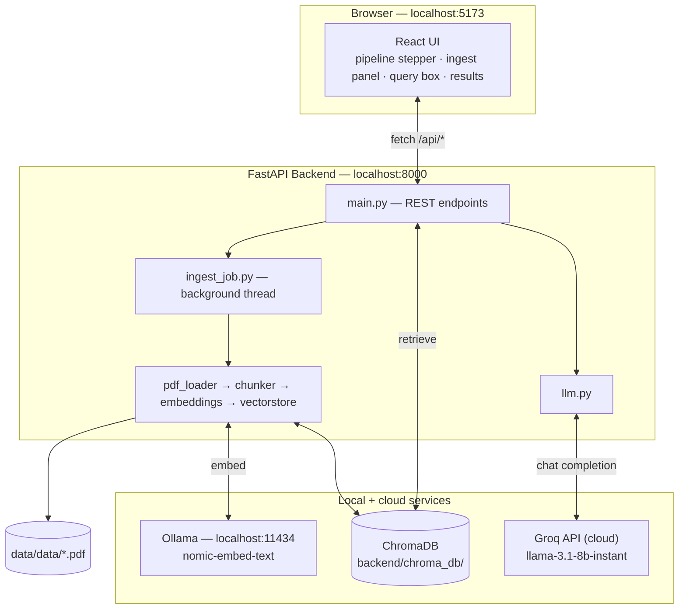
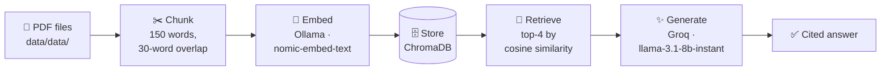
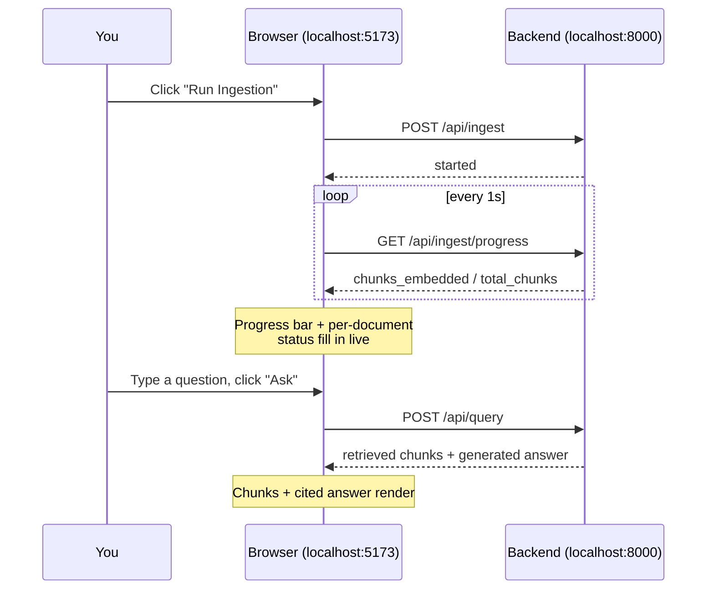

# RAG Explorer

A React + FastAPI demo that walks through a full **Retrieval-Augmented Generation (RAG)** pipeline end to end — PDF ingestion, chunking, embedding, vector storage, retrieval, and LLM answer generation — with every stage visible in the UI as it happens.

It's built as a *teaching tool*: instead of hiding the pipeline behind a single chat box, you see the chunks it created, the embedding vectors it generated, what got retrieved for your question and how similar each match was, and exactly which chunks the LLM used to write its answer.

> 📖 For a deep, diagram-heavy technical walkthrough of every module and design decision, see **[Flow_Control.md](Flow_Control.md)**.

---

## Table of contents

- [How it works](#how-it-works)
- [Tech stack](#tech-stack)
- [Prerequisites](#prerequisites)
- [Setup](#setup)
- [Running it](#running-it)
- [Configuration](#configuration)
- [Project structure](#project-structure)
- [Sample data](#sample-data)
- [Troubleshooting](#troubleshooting)

---

## How it works

### Architecture



### The pipeline, step by step



1. **Ingest** — every PDF in `data/data/` is read page by page (`pypdf`).
2. **Chunk** — each page's text is split into overlapping ~150-word windows (chunks never cross a page boundary, so page numbers stay accurate for citations).
3. **Embed** — each chunk is sent to a local Ollama server running `nomic-embed-text`, using Nomic's recommended `search_document:` prefix.
4. **Store** — chunk text, its embedding, and metadata (source file, page, chunk index) are saved in a persistent local **ChromaDB** collection.
5. **Retrieve** — when you ask a question, it's embedded with the `search_query:` prefix and ChromaDB returns the top-4 most similar chunks.
6. **Generate** — those 4 chunks are handed to **Groq** (`llama-3.1-8b-instant`), which is instructed to answer *only* from that context and cite `(source, page)` for every claim.

All of this — including live per-document ingestion progress and per-chunk previews — is rendered in the UI as it happens.

---

## Tech stack

| Layer | Technology |
|---|---|
| Frontend | React 19 + Vite 5 |
| Backend API | FastAPI (Python) |
| PDF parsing | [pypdf](https://pypdf.readthedocs.io/) |
| Embeddings | [`nomic-embed-text`](https://ollama.com/library/nomic-embed-text) via local [Ollama](https://ollama.com) |
| Vector store | [ChromaDB](https://www.trychroma.com/) (local, persistent) |
| LLM | [Groq API](https://console.groq.com) — `llama-3.1-8b-instant` |

---

## Prerequisites

- **Python 3.12** with the packages in `backend/requirements.txt`
- **Node.js 20+** and npm
- **[Ollama](https://ollama.com)** installed locally, with the embedding model pulled:
  ```bash
  ollama pull nomic-embed-text
  ```
- A **Groq API key** — get one free at [console.groq.com](https://console.groq.com)

---

## Setup

### 1. Backend

```bash
cd backend
pip install -r requirements.txt
cp .env.example .env
```

Open `backend/.env` and fill in your key:

```env
GROQ_API_KEY=your_groq_api_key_here
GROQ_MODEL=llama-3.1-8b-instant
OLLAMA_BASE_URL=http://localhost:11434
EMBED_MODEL=nomic-embed-text
```

> ⚠️ **Windows note:** `chromadb` depends on a compiled `chroma-hnswlib` extension. If `pip install` pulls a version with no prebuilt wheel for your Python version, pin one explicitly:
> ```bash
> pip install chroma-hnswlib==0.7.5
> ```

### 2. Frontend

```bash
cd frontend
npm install
```

---

## Running it

Start all three services, each in its own terminal:

```bash
# 1 — embedding model server (skip if already running as a service)
ollama serve

# 2 — backend API
cd backend
python -m uvicorn app.main:app --port 8000

# 3 — frontend dev server
cd frontend
npm run dev
```

Then open **http://localhost:5173**.



Click **Run Ingestion** to process every PDF in `data/data`, then ask a question once at least some documents show `done`. Ingestion runs as a background job with live progress — since embedding happens on CPU via Ollama, processing the full 10-document sample corpus (~330 chunks) can take several minutes. You can start asking questions about already-indexed documents while the rest are still being embedded.

---

## Configuration

Everything is configurable via `backend/.env` (see `backend/.env.example`):

| Variable | Default | Meaning |
|---|---|---|
| `GROQ_API_KEY` | *(required)* | Your Groq API key |
| `GROQ_MODEL` | `llama-3.1-8b-instant` | Groq model used for answer generation |
| `OLLAMA_BASE_URL` | `http://localhost:11434` | Local Ollama server address |
| `EMBED_MODEL` | `nomic-embed-text` | Embedding model (must be pulled in Ollama) |
| `CHUNK_SIZE_WORDS` | `150` | Words per chunk |
| `CHUNK_OVERLAP_WORDS` | `30` | Word overlap between consecutive chunks |
| `TOP_K` | `4` | Number of chunks retrieved per query |
| `DATA_DIR` | `<project_root>/data/data` | Folder scanned for source PDFs |
| `CHROMA_DIR` | `backend/chroma_db` | Where the vector index is persisted |

---

## Project structure

```
RAG_Explorer_E_Commerce/
├── data/data/                 Source PDFs to ingest (sample: 10 ShopSphere e-commerce BRDs)
├── backend/                   FastAPI app
│   ├── app/
│   │   ├── pdf_loader.py      Extracts per-page text from PDFs (pypdf)
│   │   ├── chunker.py         Splits page text into overlapping word-based chunks
│   │   ├── embeddings.py      Calls local Ollama for Nomic Embed vectors
│   │   ├── vectorstore.py     ChromaDB persistent client (backend/chroma_db)
│   │   ├── ingest_job.py      Background thread + progress state for /api/ingest
│   │   ├── llm.py             Groq chat completion, grounded in retrieved chunks
│   │   └── main.py            FastAPI routes
│   ├── requirements.txt
│   └── .env.example
├── frontend/                  React (Vite) UI
│   └── src/
│       ├── App.jsx            Pipeline state machine
│       └── components/        Stepper, ingest panel, query panel, results
├── README.md                  This file
└── Flow_Control.md            Deep-dive: diagrams, API reference, design decisions
```

---

## Sample data

`data/data/` ships with 10 fictional Business Requirement Documents for "ShopSphere Technologies Pvt. Ltd.", an invented e-commerce platform — one BRD per module (User Registration & Login, Product Catalog, Shopping Cart, Checkout & Payment, Order Management, Inventory, Returns & Refunds, Customer Reviews, Admin Dashboard, Notification Service). They share terminology, stakeholders, and integrated systems across files to simulate a real enterprise knowledge base, which makes for a good multi-document retrieval test.

**To use your own PDFs:** drop them into `data/data/` and click **Run Ingestion** again — it fully re-chunks and re-embeds everything currently in that folder.

---

## Troubleshooting

| Problem | Fix |
|---|---|
| `ModuleNotFoundError: hnswlib` or chromadb install fails | `pip install chroma-hnswlib==0.7.5` |
| Ingestion errors with "Could not reach Ollama" | Make sure `ollama serve` is running and `ollama pull nomic-embed-text` has completed |
| Query fails with a Groq error | Check `GROQ_API_KEY` in `backend/.env` and that the account has access to `GROQ_MODEL` |
| Ingestion is very slow | Expected on CPU-only Ollama (~several seconds per chunk) — this is a demo, not an optimized production pipeline |
| Frontend can't reach the backend | Confirm the backend is running on port 8000 and CORS allows `http://localhost:5173` (default in `main.py`) |
