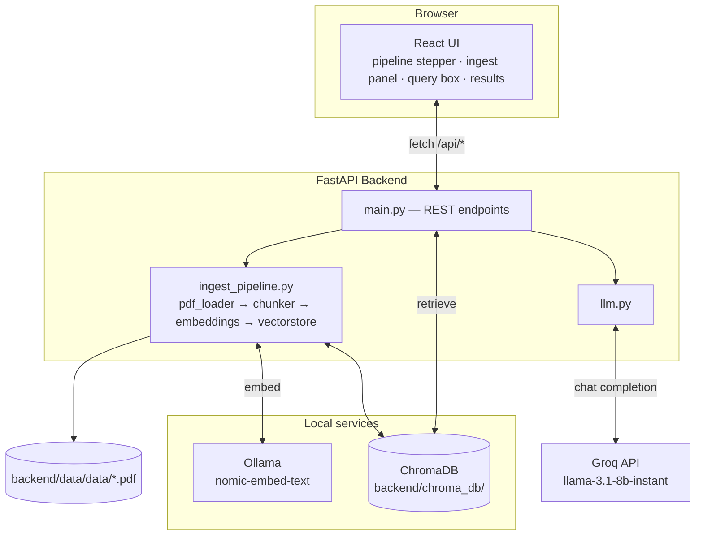
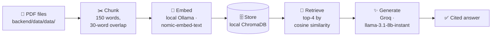
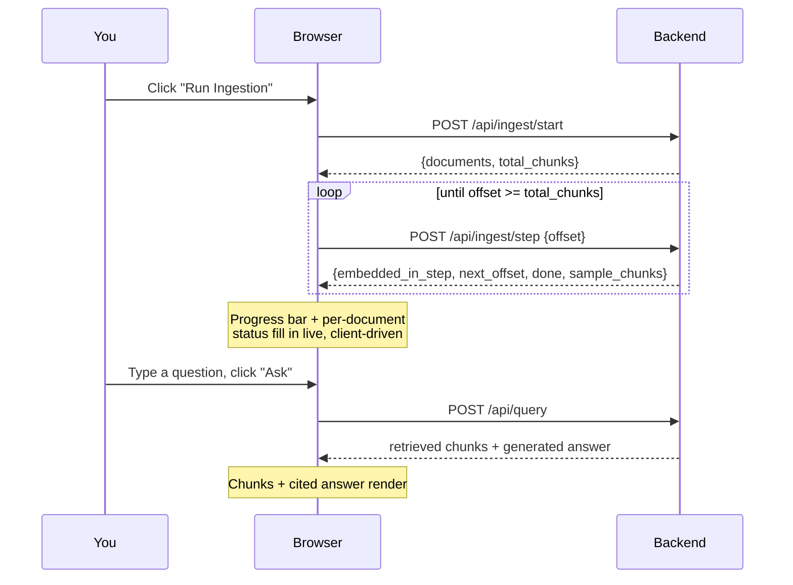

# RAG Explorer

A React + FastAPI demo that walks through a full **Retrieval-Augmented Generation (RAG)** pipeline end to end — PDF ingestion, chunking, embedding, vector storage, retrieval, and LLM answer generation — with every stage visible in the UI as it happens.

It's built as a *teaching tool*: instead of hiding the pipeline behind a single chat box, you see the chunks it created, the embedding vectors it generated, what got retrieved for your question and how similar each match was, and exactly which chunks the LLM used to write its answer.

> 🚀 For copy-pasteable from-scratch setup steps, see **[Run_Command.md](Run_Command.md)**.
> 📖 For a deep, diagram-heavy technical walkthrough of every module and design decision, see **[Flow_Control.md](Flow_Control.md)**.

---

## Table of contents

- [Demo](#demo)
- [How it works](#how-it-works)
- [Tech stack](#tech-stack)
- [Prerequisites](#prerequisites)
- [Setup](#setup)
- [Running it](#running-it)
- [Configuration](#configuration)
- [Project structure](#project-structure)
- [Sample data](#sample-data)
- [Troubleshooting](#troubleshooting)

---

## Demo

Asking a question retrieves the top-4 matching chunks (with similarity scores and source/page attribution) and generates a cited answer from them:


Every question is answered strictly from what was retrieved — here the retrieved chunks come from two different documents (Notification Service and Inventory Management), and the answer cites the specific requirement ID and source it drew from:


---

## How it works

### Architecture



### The pipeline, step by step



1. **Ingest** — every PDF in `backend/data/data/` is read page by page (`pypdf`).
2. **Chunk** — each page's text is split into overlapping ~150-word windows (chunks never cross a page boundary, so page numbers stay accurate for citations).
3. **Embed** — each chunk is sent to a **local Ollama server** (`nomic-embed-text`), using Nomic's recommended `search_document:` text prefix.
4. **Store** — chunk text, its embedding, and metadata (source file, page, chunk index) are saved in a **local ChromaDB** collection (`backend/chroma_db/`).
5. **Retrieve** — when you ask a question, it's embedded with the `search_query:` prefix and Chroma returns the top-4 most similar chunks.
6. **Generate** — those 4 chunks are handed to **Groq** (`llama-3.1-8b-instant`), which is instructed to answer *only* from that context and cite `(source, page)` for every claim.

All of this — including live per-document ingestion progress and per-chunk previews — is rendered in the UI as it happens. Ingestion itself is driven from the browser: `POST /api/ingest/start` resets the store and returns the chunk plan, then the frontend loops calling `POST /api/ingest/step` with an advancing offset (each call embeds ~20 chunks) until done — so progress is visible without a polled server-side job.

---

## Tech stack

| Layer | Technology |
|---|---|
| Frontend | React 19 + Vite 5 |
| Backend API | FastAPI (Python) |
| PDF parsing | [pypdf](https://pypdf.readthedocs.io/) |
| Embeddings | Local [Ollama](https://ollama.com) — `nomic-embed-text` |
| Vector store | Local [ChromaDB](https://www.trychroma.com/) (`backend/chroma_db/`) |
| LLM | [Groq API](https://console.groq.com) — `llama-3.1-8b-instant` |

Everything runs on your machine except answer generation, which calls the hosted Groq API.

---

## Prerequisites

- **Python 3.12** with the packages in `backend/requirements.txt`
- **Node.js 20+** and npm
- **[Ollama](https://ollama.com)** installed and running locally, with the embedding model pulled:
  ```bash
  ollama pull nomic-embed-text
  ```
- A **Groq API key** — [console.groq.com](https://console.groq.com)

---

## Setup

### 1. Backend

```bash
cd backend
pip install -r requirements.txt
cp .env.example .env
```

Open `backend/.env` and fill in your key:

```env
GROQ_API_KEY=your_groq_api_key_here
GROQ_MODEL=llama-3.1-8b-instant

OLLAMA_BASE_URL=http://localhost:11434
EMBED_MODEL=nomic-embed-text
```

> ⚠️ **Windows note:** older `chromadb` releases depend on a compiled `chroma-hnswlib` extension with no prebuilt Windows wheel. If `pip install` tries to build one from source and fails (needs C++ build tools), leave `chromadb` unpinned in `requirements.txt` so it resolves to a current release — recent versions don't have this dependency.

### 2. Frontend

```bash
cd frontend
npm install
```

---

## Running it

```bash
# 0 — make sure Ollama is running (if not already)
ollama serve

# 1 — backend API
cd backend
python -m uvicorn app.main:app --port 8000

# 2 — frontend dev server
cd frontend
npm run dev
```

Then open **http://localhost:5173**.



Click **Run Ingestion** to process every PDF in `backend/data/data`, then ask a question once at least some documents show `done`. You can start asking questions about already-indexed documents while the rest are still being embedded.

---

## Configuration

Everything is configurable via `backend/.env` (see `backend/.env.example`):

| Variable | Default | Meaning |
|---|---|---|
| `GROQ_API_KEY` | *(required)* | Your Groq API key |
| `GROQ_MODEL` | `llama-3.1-8b-instant` | Groq model used for answer generation |
| `OLLAMA_BASE_URL` | `http://localhost:11434` | Local Ollama server URL |
| `EMBED_MODEL` | `nomic-embed-text` | Ollama embedding model |
| `CHUNK_SIZE_WORDS` | `150` | Words per chunk |
| `CHUNK_OVERLAP_WORDS` | `30` | Word overlap between consecutive chunks |
| `TOP_K` | `4` | Number of chunks retrieved per query |
| `INGEST_STEP_BATCH_SIZE` | `20` | Chunks embedded per `/api/ingest/step` call |
| `DATA_DIR` | `backend/data/data` | Folder scanned for source PDFs |
| `CHROMA_DIR` | `backend/chroma_db` | Folder where the local Chroma collection is persisted |

`frontend/.env` (see `frontend/.env.example`) has one variable: `VITE_API_BASE_URL`, the backend's URL (defaults to `http://localhost:8000` if unset).

---

## Project structure

```
RAG_Explorer_E_Commerce/
├── backend/                    FastAPI app
│   ├── app/
│   │   ├── pdf_loader.py       Extracts per-page text from PDFs (pypdf)
│   │   ├── chunker.py          Splits page text into overlapping word-based chunks
│   │   ├── embeddings.py       Calls a local Ollama server for embeddings
│   │   ├── vectorstore.py      Local ChromaDB (PersistentClient) wrapper
│   │   ├── ingest_pipeline.py  Stateless chunk-plan + step-based ingestion
│   │   ├── llm.py              Groq chat completion, grounded in retrieved chunks
│   │   └── main.py             FastAPI routes
│   ├── data/data/               Source PDFs to ingest (sample: 10 ShopSphere e-commerce BRDs)
│   ├── chroma_db/               Local persisted vector store (gitignored)
│   ├── requirements.txt
│   └── .env.example
├── frontend/                   React (Vite) UI
│   └── src/
│       ├── App.jsx             Pipeline state machine (drives the ingest loop)
│       └── components/         Stepper, ingest panel, query panel, results
├── README.md                   This file
└── Flow_Control.md             Deep-dive: diagrams, API reference, design decisions
```

---

## Sample data

`backend/data/data/` ships with 10 fictional Business Requirement Documents for "ShopSphere Technologies Pvt. Ltd.", an invented e-commerce platform — one BRD per module (User Registration & Login, Product Catalog, Shopping Cart, Checkout & Payment, Order Management, Inventory, Returns & Refunds, Customer Reviews, Admin Dashboard, Notification Service). They share terminology, stakeholders, and integrated systems across files to simulate a real enterprise knowledge base, which makes for a good multi-document retrieval test.

**To use your own PDFs:** drop them into `backend/data/data/` and click **Run Ingestion** again — it fully re-chunks and re-embeds everything currently in that folder.

---

## Troubleshooting

| Problem | Fix |
|---|---|
| `chromadb` install fails building `hnswlib` (needs C++ build tools) | Remove any `chromadb==` version pin in `requirements.txt` and reinstall — current releases don't depend on compiled `hnswlib` |
| Ingestion fails with "Could not reach Ollama" | Make sure `ollama serve` is running and `ollama pull nomic-embed-text` has completed |
| `/api/status` or `/api/query` returns `502 Could not open local Chroma store` | Check that `CHROMA_DIR` (or its default, `backend/chroma_db/`) is writable |
| Query fails with a Groq error | Check `GROQ_API_KEY` in `backend/.env` and that the account has access to `GROQ_MODEL` |
| Frontend can't reach the backend | Confirm the backend is running on port 8000 (`curl http://localhost:8000/api/health`) |
